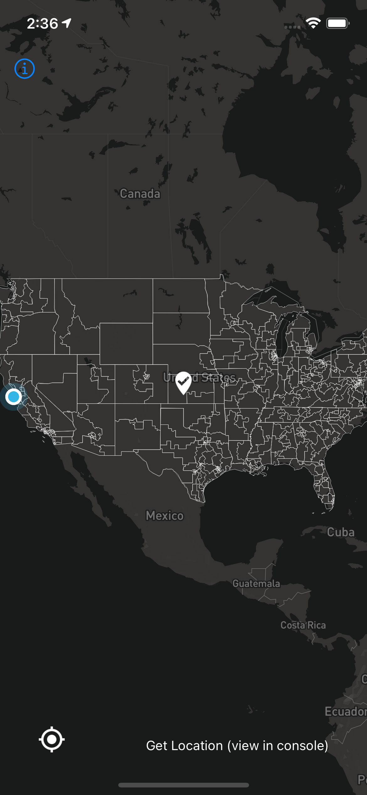

# react-native-select-location-map-or-access

| Created by    | [Andrew-Chen-Wang](https://github.com/Andrew-Chen-Wang)
| ------------- |-------------
| Created on    | 26 July 2021, 0002
| Finished      | 26 July 2021, 0121
| License       | Apache 2.0 License. You can find the license in the [LICENSE file](./LICENSE)

This repository was created for the [Hear Ye app](https://hearye.us/).
This utilizes the free MapBox SDK.

It shows all U.S. Congressional Districts and a
location pin at the center of the screen. Additionally,
it supports dark mode using the `useColorScheme` hook.



### Usage

Go to [App.js](./App.js) and change the API key to your
own MapBox API key (it's free, no credit card needed).

Then run (there's a `.nvmrc` file):

```shell
npm run start
```

Finally, start your device:

```shell
npm run ios
```
